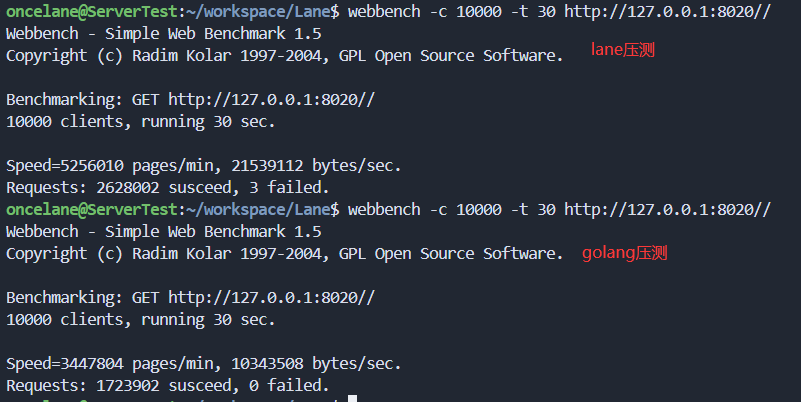

# Lane

本项目基于 sylar 和 lunar 的协程服务器框架，以体验优化技术为主要目标，将重写整个服务器框架

优化： gmp 调度，boost.fcontext 协程切换

实现：协程锁、协程条件变量、channel(未完全测试)

待实现： 协程池、select

# 压测数据

新使用了 linux spinlock 作为 worksteal 的锁

lane: QPS 8.7W+

```sh
oncelane@ServerTest:~/workspace/Lane$ webbench -c 10000 -t 30 http://127.0.0.1:8020/
Webbench - Simple Web Benchmark 1.5
Copyright (c) Radim Kolar 1997-2004, GPL Open Source Software.

Benchmarking: GET http://127.0.0.1:8020/
10000 clients, running 30 sec.

Speed=5228458 pages/min, 21411062 bytes/sec.
Requests: 2614222 susceed, 7 failed

```

golang: QPS 7.0W+

```sh
oncelane@ServerTest:~/workspace/Lane$ webbench -c 10000 -t 30 http://127.0.0.1:8020/
Webbench - Simple Web Benchmark 1.5
Copyright (c) Radim Kolar 1997-2004, GPL Open Source Software.

Benchmarking: GET http://127.0.0.1:8020/
10000 clients, running 30 sec.

Speed=4198046 pages/min, 19871110 bytes/sec.
Requests: 2099023 susceed, 0 failed.
```

```sh 数据
# lane 数据
oncelane@ServerTest:~/workspace/Lane$ curl -i -X GET http://127.0.0.1:8020/
HTTP/1.1 404 Not Found
Content-Type: text/html
Server: lane/1.0.0
connection: close
content-length: 135

<html><head><title>404 Not Found</title></head><body><center><h1>404 Not Found</h1></center><hr><center>lane/1.0</center></body></html>

# golang 数据
oncelane@ServerTest:~/workspace/Lane$ curl -i -X GET http://127.0.0.1:8020/
HTTP/1.1 200 OK
Date: Wed, 25 Sep 2024 07:08:35 GMT
Content-Length: 167
Content-Type: text/html; charset=utf-8

<html><head><title>404 Not Found
                </title></head><body><center><h1>404 Not Found</h1></center>
                <hr><center> golg </center></body></html>

# 加多一个“/”后缀，打向不存在的网址

# lane:
oncelane@ServerTest:~/workspace/Lane$ curl -i -X GET http://127.0.0.1:8020//
HTTP/1.1 404 Not Found
Content-Type: text/html
Server: lane/1.0.0
connection: close
content-length: 135

<html><head><title>404 Not Found</title></head><body><center><h1>404 Not Found</h1></center><hr><center>lane/1.0</center></body></html>

# golang:
oncelane@ServerTest:~/workspace/Lane$ curl -i -X GET http://127.0.0.1:8020//
HTTP/1.1 301 Moved Permanently
Content-Type: text/html; charset=utf-8
Location: /
Date: Wed, 25 Sep 2024 07:09:32 GMT
Content-Length: 36

<a href="/">Moved Permanently</a>.
```

压测相同内容，均为 135 bytes：


lane 压测页面内容不变为 135 bytes，golang 压测页面内容减少，为 36 bytes



# 项目依赖

```bash
# boost
sudo apt install libboost-all-dev

# json
sudo apt install libjsoncpp-dev

# ragel
sudo apt install ragel

# yaml-cpp.git
git clone https://github.com/jbeder/yaml-cpp.git
cd yaml-cpp
mkdir build
cd build
cmake ..
make -j8
sudo make install
```

# 项目启动

1. 拉取仓库

```bash
git clone https://github.com/Oncelane/Lane.git
cd Lane
```

切换分支

```bash
git checkout boost-context
```

2. 编译

```bash
mkdir build
cd build
cmake ..
make -j8
```

3. 运行、压测

```sh
webbench 下载

#1.1 安装依赖 exuberant-ctags
sudo apt-get install exuberant-ctags
#1.2 下载源码并安装
wget http://blog.s135.com/soft/linux/webbench/webbench-1.5.tar.gz
tar zxvf webbench-1.5.tar.gz
cd webbench-1.5
make && sudo make install
# 如果出现 <rpc/types.h> 头文件错误
# 打开 webbench.c 编辑
# vim webbench.c
# 修改头文件#include <rpc/types.h> 为#include <sys/types.h>
```

```sh
../bin/test_httpserver
webbench -c 1000 -t 30 http://127.0.0.1:8020//
```

4. valgrind

安装

```sh
sudo apt-get install valgrind
```

运行

```sh

```

# 开发环境

https://blog.csdn.net/m0_72743841/article/details/139465617

clangd-17
