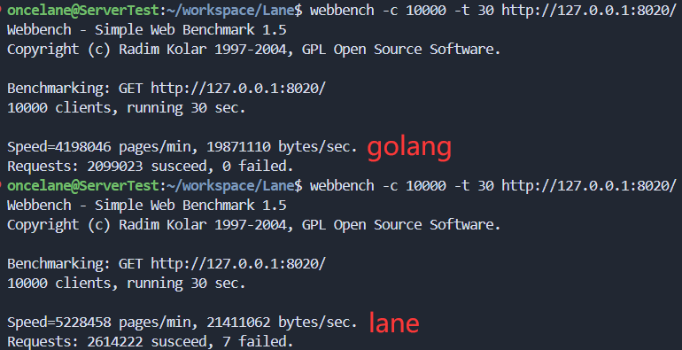

# Lane

本项目基于 sylar 和 lunar 的协程服务器框架，以体验优化技术为主要目标,重点优化协程模块

已实现

- gmp 调度，worksteal 调度模式
- boost.fcontext 协程切换
- 协程互斥锁
- 协程信号量
- channel(无缓冲/有缓冲)
- waitGroup
- 协程池

# 协程切换压测

一千万次协程切换耗时

| 项目   | 耗时   | 切换性能 |
| ------ | ------ | -------- |
| lane   | 817 ms | 81 ns    |
| golang | 690 ms | 69 ns    |

```
switch[1000]: go: 10000000 switches in 690 ms, 14492753 switches per second
switch[1000]: lane: 10000000 switches in 817 ms, 12229886 switches per second
```

# 服务器压测

| 项目   | QPS   |
| ------ | ----- |
| lane   | 8.71W |
| golang | 7.00W |

测试页面：

```sh
oncelane@ServerTest:~/workspace/Lane$ curl -i -X GET http://127.0.0.1:8020/
HTTP/1.1 404 Not Found
Content-Type: text/html
Server: lane/1.0.0
connection: close
content-length: 135

<html><head><title>404 Not Found</title></head><body><center><h1>404 Not Found</h1></center><hr><center>lane/1.0</center></body></html>
```

压测相同内容，均为 135 bytes：



lane 压测页面内容不变为 135 bytes，golang 压测页面内容减少，为 36 bytes


在另一配置较差笔记本上的压测数据：

| 项目         | QPS   |
| ------------ | ----- |
| lane O0 编译 | 3.39W |
| golang       | 3.97W |
| lane O2 编译 | 5.96W |

# 使用

1. 创建使用两个线程的协程调度器`iom`
2. 简单的使用`co`开启协程
3. `defer`注册延迟执行函数,此函数会在协程 panic 或 return 后执行
4. `panic`发起一个中断，中止协程运行
5. 在 defer 代码块中使用`recovery`处理错误并恢复协程

```cpp

void TestMain() {
    co[]() {

        defer[]() {
            info() << "defer1";
        };
        defer[]() {
            info() << "defer2";
        };
        defer[]() {
            info() << "defer3";
            auto e = recovery();
            if (e.has_value()) {
                info() << "recovery this error:" << e.value().what();
            }
        };

        info() << "throw panic";

        panic("panic");

        info() << "safe return";
    };
}


int main() {
    lane::IOManager iom(2, "hello", false);
    iom.addTask(TestMain);
}

```

执行结果

```
tests/.cc:26            throw panic
tests/test_defer.cc:19  defer3
tests/test_defer.cc:22  recovery this error:std::exception
tests/test_defer.cc:30  safe return
tests/test_defer.cc:16  defer2
tests/test_defer.cc:13  defer1
```

> 缺陷是 e.what()丢失了原始值，可以通过模板解决，后续再弄

# 协程同步方法

### waitGroup

`waitGroup`与 golang 的 `sync.WaitGroup` 语义一致
方法：
`add(int)`
`done()`
`wait()`

示例代码

```cpp

void TestWaitGroup() {
    info() << "start runing";
    auto wait = new lane::WaitGroup;

    for (int i = 0; i < 5; ++i) {
        wait->add(1);
        co[=]() {
            defer[&]() {
                wait->done();
            };
            sleep(1);
            info() << " fast finish";
        };
    }
    wait->add(1);
    co[=]() {
        defer[&]() {
            wait->done();
        };
        sleep(2);
        info() << " slow finish";
    };

    wait->wait();
    info() << "end";
}

void TestMain() {
    lane::IOManager iom(2, "waitgroup", false);
    iom.addTask(TestWaitGroup);
}

```

输出

```
2024-10-09 16:35:26     205332  waitgroup0      3       [INFO]  [root]  tests/test_waitGroup.cc:12      start runing
2024-10-09 16:35:27     205333  waitgroup1      9       [INFO]  [root]  tests/test_waitGroup.cc:22       fast finish
2024-10-09 16:35:27     205333  waitgroup1      8       [INFO]  [root]  tests/test_waitGroup.cc:22       fast finish
2024-10-09 16:35:27     205333  waitgroup1      7       [INFO]  [root]  tests/test_waitGroup.cc:22       fast finish
2024-10-09 16:35:27     205332  waitgroup0      6       [INFO]  [root]  tests/test_waitGroup.cc:22       fast finish
2024-10-09 16:35:27     205333  waitgroup1      10      [INFO]  [root]  tests/test_waitGroup.cc:22       fast finish
2024-10-09 16:35:28     205332  waitgroup0      11      [INFO]  [root]  tests/test_waitGroup.cc:31       slow finish
2024-10-09 16:35:28     205332  waitgroup0      3       [INFO]  [root]  tests/test_waitGroup.cc:35      end
```

### Channel

`channel`语义与 golang 的 `channel` 保持一致

示例代码: 经典两个协程交替打印数字和字母

```cpp
void TestPrint() {
    auto wg = new lane::WaitGroup;

    // 创建两个 无缓冲channel，分别用于控制字母和数字的打印
    auto letters = lane::Channel<bool>(0);
    auto numbers = lane::Channel<bool>(0);

    // 字母打印协程
    wg->add(1);
    co[&]() {
        defer[&]() {
            wg->done();
        };
        for (char ch = 'A'; ch <= 'C'; ch++) {
            info() << ch;  // 打印字母
            letters.input(true);  // 发送信号，通知数字打印协程可以打印
            numbers.output();  // 等待数字打印协程的信号
        }
        letters.close();  // 关闭字母 channel
    };


    // 数字打印协程
    wg->add(1);
    co[&]() {
        defer[&]() {
            wg->done();
        };
        for (int num = 1; num <= 3; num++) {
            letters.output();  // 等待字母打印协程的信号
            info() << num;     // 打印数字
            numbers.input(true);
        }
        numbers.close();  // 关闭数字 channel
    };

    wg->wait();  // 等待所有协程完成
}


int main() {
    lane::IOManager iom(2, "channel", false);
    iom.addTask(TestPrint);
    return 0;
}
```

输出

```
[INFO]  [root]  tests/test_channel.cc:84        A
[INFO]  [root]  tests/test_channel.cc:100       1
[INFO]  [root]  tests/test_channel.cc:84        B
[INFO]  [root]  tests/test_channel.cc:100       2
[INFO]  [root]  tests/test_channel.cc:84        C
[INFO]  [root]  tests/test_channel.cc:100       3
```

# 项目依赖

```bash
# boost
sudo apt install libboost-all-dev

# json
sudo apt install libjsoncpp-dev

# ragel
sudo apt install ragel

# yaml-cpp.git
git clone https://github.com/jbeder/yaml-cpp.git
cd yaml-cpp
mkdir build
cd build
cmake ..
make -j8
sudo make install
```

# 项目启动

1. 拉取仓库

```bash
git clone https://github.com/Oncelane/Lane.git
cd Lane
```

切换分支

```bash
git checkout little-work
```

2. 编译

```bash
mkdir build
cd build
cmake ..
make -j8
```

3. 运行、压测

```sh
webbench 下载

#1.1 安装依赖 exuberant-ctags
sudo apt-get install exuberant-ctags
#1.2 下载源码并安装
wget http://blog.s135.com/soft/linux/webbench/webbench-1.5.tar.gz
tar zxvf webbench-1.5.tar.gz
cd webbench-1.5
make && sudo make install
# 如果出现 <rpc/types.h> 头文件错误
# 打开 webbench.c 编辑
# vim webbench.c
# 修改头文件#include <rpc/types.h> 为#include <sys/types.h>
```

```sh
../bin/test_httpserver
webbench -c 1000 -t 30 http://127.0.0.1:8020//
```

4. valgrind

安装

```sh
sudo apt-get install valgrind
```

运行

```sh
../bin/test_httpserver
```

压测

```sh
 webbench -c 8000 -t 30 http://127.0.0.1:8020/
```

# 开发环境

https://blog.csdn.net/m0_72743841/article/details/139465617

clangd-17
